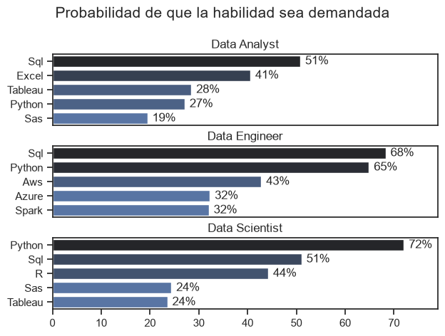
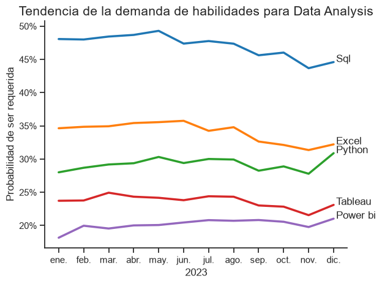
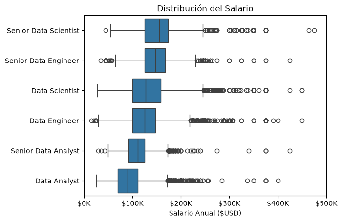
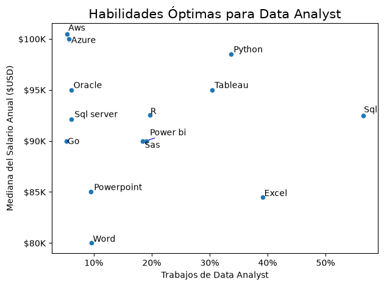

# Análisis del Mercado Laboral en Roles de Datos

Este proyecto consiste en un análisis exploratorio de datos sobre el mercado laboral de la industria de datos, enfocado en identificar las habilidades más demandadas, las tendencias de mercado, los salarios promedios y las habilidades óptimas para impulsar una carrera en **Data Analysis**, **Data Science** y **Data Engineering**.

El projecto lo armé con el objetivo de tener una práctica realista tras completar un curso de Python enfocado en Análisis de Datos.

## Herramientas Utilizadas

Para el desarrollo de los análisis utilicé las siguientes herramientas:

- **Python**: Lenguaje principal de programación.
  - **Pandas**: Para la manipulación, limpieza y análisis de datos.
  - **Matplotlib** y **Seaborn**: Para la creación de visualizaciones y gráficos estadísticos.
- **Visual Studio Code**: Entorno de desarrollo integrado (IDE).
- **Jupyter Notebooks**: Para la ejecución modular de código y documentación interactiva.
- **Git y GitHub**: Control de versiones y publicación del proyecto.

---

## 1. ¿Cuáles son las 3 habilidades más demandadas para los 3 roles de datos más populares?

Para identificar las 3 habilidades más demandadas en el área de datos, filtré los puestos de trabajo más populares y obtuve las 5 habilidades más requeridas para cada uno de estos 3 roles principales (*Data Analyst*, *Data Engineer* y *Data Scientist*).

Este resultado permite visualizar claramente los requisitos del mercado laboral, facilitando la toma de decisiones sobre qué tecnologías aprender según el rol objetivo.

📌 **Notebook del análisis:** [`1_Demanda_Habilidades.ipynb`](Project/1_Demanda_Habilidades.ipynb)

### Código del gráfico

```python
import matplotlib.pyplot as plt
import seaborn as sns

fig, ax = plt.subplots(len(job_titles), 1, figsize=(10, 8))
sns.set_theme(style='ticks')

for i, job_title in enumerate(job_titles):
    df_plot = df_skills_perc[df_skills_perc['job_title_short'] == job_title].head(5)
    sns.barplot(
        data=df_plot, 
        x='skill_perc', 
        y='job_skills', 
        ax=ax[i], 
        hue='skill_count', 
        palette='dark:b_r', 
        legend=False
    )
    ax[i].set_title(job_title)
    ax[i].set_ylabel('')
    ax[i].set_xlabel('')
    ax[i].set_xlim(0, 79)

    for n, v in enumerate(df_plot['skill_perc']):
        ax[i].text(v + 1, n, f'{v:.0f}%', va='center')

    if i != len(job_titles) - 1:
        ax[i].set_xticks([])

fig.suptitle('Probabilidad de que la habilidad sea demandada', fontsize=15)
plt.tight_layout(h_pad=0.5)
plt.show()
```

### Resultados



### Descubrimientos

- **SQL** es la habilidad más demandada en general, apareciendo en más de la mitad de las ofertas laborales para los tres roles.
- **Python** presenta una altísima demanda en los tres roles debido a su versatilidad, destacándose especialmente en *Data Science*.
- **Excel** y **Tableau** tienen un mayor impacto y demanda dentro del rol de *Data Analyst*.
- Los conocimientos en **tecnologías Cloud** (nube) resultan fundamentales para el rol de *Data Engineering*.

---

## 2. ¿Qué tendencias siguen la demanda de las habilidades más importantes en análisis de datos?

Para este análisis se realizó la importación de las librerías necesarias, la carga del dataset y una fase inicial de limpieza de datos.

Posteriormente, se filtraron únicamente las ofertas orientadas al puesto de **Data Analyst**. Mediante *Pivot Tables*, se construyó una tabla donde las columnas representan las 5 habilidades más frecuentes y las filas corresponden a los meses del año, registrando la frecuencia absoluta de cada una. Luego, se calculó la proporción respecto al total de búsquedas laborales de cada mes para obtener el porcentaje correspondiente.

Con esta estructura de datos, se generó un gráfico de líneas para visualizar las tendencias temporales a lo largo del año.

📌 **Notebook del análisis:** [`2_Tendencia_De_La_Demanda.ipynb`](Project/2_Tendencia_De_La_Demanda.ipynb)

### Código del gráfico

```python
import matplotlib.pyplot as plt
import seaborn as sns
from matplotlib.ticker import PercentFormatter

df_plot = df_DA_perc.iloc[:, :5]

sns.lineplot(data=df_plot, dashes=False, palette='tab10', linewidth=2.5)
sns.set_theme(style='ticks')
sns.despine()

plt.title('Tendencia de la demanda de habilidades para Data Analyst', fontsize=15)
plt.legend().remove()
plt.ylabel('Probabilidad de ser requerida')
plt.xlabel('2023')

ax = plt.gca()
ax.yaxis.set_major_formatter(PercentFormatter(decimals=0))

txt = []
for i in range(5):
    t = plt.text(11.1, df_plot.iloc[-1, i], df_plot.columns[i])
    txt.append(t)

plt.tight_layout()
plt.show()
```

### Resultados



### Descubrimientos

- **SQL** se mantiene consistentemente como la habilidad más demandada, aunque muestra una leve tendencia a la baja hacia fin de año.
- **Excel** ocupa el segundo lugar en demanda, experimentando una caída moderada durante la segunda mitad del año.
- **Python** muestra un incremento sostenido en su demanda durante los últimos dos meses del año.
- **Power BI** y **Tableau** presentan una demanda similar y un comportamiento estable durante todo el período analizado.

---

## 3. ¿Cuánto se gana en los puestos de Data Analyst?

En esta sección se procesaron y limpiaron los datos salariales para generar un gráfico de diagrama de caja (*Boxplot*). En él se compara la distribución del salario anual entre los tres roles principales de datos (*Data Analyst*, *Data Engineer* y *Data Scientist*) junto con sus respectivos niveles *Senior*.

📌 **Notebook del análisis:** [`3_Analisis_Salario.ipynb`](Project/3_Analisis_Salario.ipynb)

### Código del gráfico

```python
import matplotlib.pyplot as plt
import seaborn as sns

sns.boxplot(data=df_top6, x='salary_year_avg', y='job_title_short', order=job_order)

ax = plt.gca()
ax.xaxis.set_major_formatter(plt.FuncFormatter(lambda x, pos: f'${int(x/1000)}K'))
plt.title('Distribución del Salario por Rol')
plt.xlabel('Salario Anual ($USD)')
plt.xlim(0, 500_000)
plt.ylabel('')
plt.show()
```

### Resultados



### Descubrimientos

- Como era de esperarse, los puestos **Senior** perciben salarios significativamente mayores que los roles *mid/junior*.
- El rol de **Senior Data Analyst** presenta una mediana salarial inferior a la de **Data Engineer** y **Data Scientist**. Esto sugiere que para maximizar el crecimiento económico en el área de análisis, es conveniente adquirir conocimientos avanzados propios de las ramas de *Data Science* e *Infrastructure/Data Engineering*.

---

## 4. ¿Cuáles son las habilidades óptimas para Data Analyst?

Para determinar las habilidades "óptimas" (que combinan alta demanda y buena remuneración), se filtró el dataset considerando únicamente el puesto de **Data Analyst**. Se tomaron las habilidades ubicadas en el **Top 5%** de demanda laboral, cruzándolas con la mediana salarial que ofrecen y su porcentaje de aparición en las ofertas laborales.

📌 **Notebook del análisis:** [`4_Habilidades_Optimas.ipynb`](Project/4_Habilidades_Optimas.ipynb)

### Código del gráfico

```python
import matplotlib.pyplot as plt
from matplotlib.ticker import PercentFormatter
from adjustText import adjust_text

df_DA_skills_high_demand.plot(kind='scatter', x='skill_percent', y='median_salary')

texts = []
for i, txt in enumerate(df_DA_skills_high_demand.index):
    texts.append(
        plt.text(
            df_DA_skills_high_demand['skill_percent'].iloc[i], 
            df_DA_skills_high_demand['median_salary'].iloc[i], 
            txt.capitalize()
        )
    )

plt.xlabel('Porcentaje de Ofertas que la Recomiendan (%)')
plt.ylabel('Mediana del Salario Anual ($USD)')
plt.title('Habilidades Óptimas para Data Analyst', fontsize=15)

adjust_text(texts, arrowprops=dict(arrowstyle='->', color='b', lw=0.8))

ax = plt.gca()
ax.yaxis.set_major_formatter(plt.FuncFormatter(lambda y, pos: f'${int(y/1000)}K'))
ax.xaxis.set_major_formatter(PercentFormatter(decimals=0))

plt.tight_layout()
plt.show()
```

### Resultados



### Descubrimientos

- **Python**, **Tableau** y **SQL** representan el equilibrio óptimo entre alta demanda laboral y salarios competitivos para un *Data Analyst*.
- Habilidades ofimáticas básicas como **Word** o **PowerPoint** presentan baja demanda relativa y no aportan un incremento salarial significativo.
- Las herramientas especializadas en la **Nube** (*Cloud Computing*) están asociadas a los salarios más altos, aunque actualmente cuentan con un volumen de demanda menor para perfiles estrictamente de *Data Analyst*.

---

## Conclusiones Finales

Este proyecto permitió extraer insights clave sobre el estado actual del mercado laboral en la industria de datos:

1. **La triada fundamental (Core Stack):** **SQL** y **Python** son herramientas indiscutibles y transversales a los tres roles analizados. Dominar ambas bases es el requisito de entrada más sólido para cualquier profesional que busque insertarse en el sector.
2. **Especialización vs. Generalización:** Mientras que **Excel** y herramientas de BI (**Power BI / Tableau**) sostienen la operatividad diaria del *Data Analyst*, la transición hacia salarios más competitivos requiere incorporar habilidades de programación avanzada (*Python*) y tecnologías en la **Nube** (*Cloud Computing*), áreas donde convergen la *Data Science* y la *Data Engineering*.
3. **Crecimiento Profesional:** El análisis salarial evidencia que el mayor salto económico no solo proviene de la antigüedad (*Seniority*), sino de la capacidad de evolucionar la infraestructura de datos y el modelado predictivo.

### Aprendizajes Personales
A nivel técnico, la realización de este proyecto me permitió consolidar el uso de **Pandas** para la manipulación y filtrado avanzado de datos, aplicar la libreria **adjustText** para resolver superposiciones visuales en gráficos dispersos de **Matplotlib/Seaborn**, y estructurar un flujo de trabajo reproducible mediante **Jupyter Notebooks** y control de versiones con **Git/GitHub**.